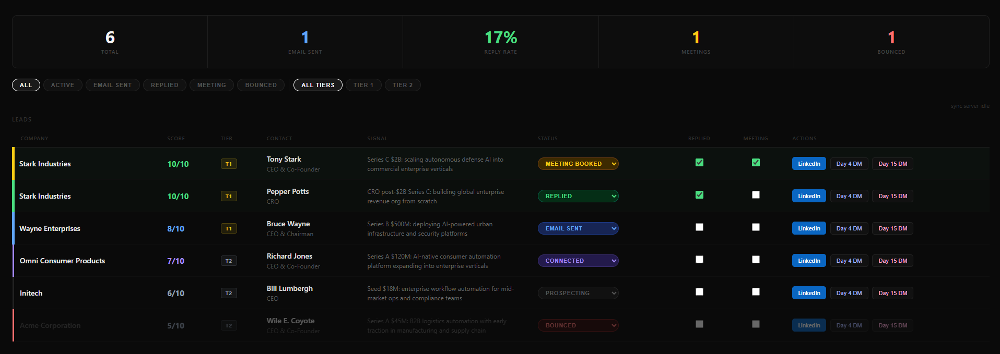

# Autonomous GTM Engine ⚡️




A high-velocity technical sales infrastructure designed for autonomous market research, tiered lead prioritization, and hyper-personalized outreach drafting. 

This engine was built to eliminate the manual "grunt work" of prospecting, allowing a founding or early-stage sales rep to focus exclusively on high-leverage activities like recording personalized Looms and closing deals.

## 🛠 The Stack
- **Runtime:** Node.js / TypeScript
- **Intelligence:** Anthropic Claude 3.5 Sonnet & Haiku
- **Data Layer:** JSON-based local cache & CSV integration
- **UI:** Dynamic HTML/CSS "Strike Dashboard" for mission control

## 📂 Project Structure (Private)
```text
├── blivz/
│   ├── research_agents.ts       # Parallelized Claude-3-Sonnet research logic
│   ├── whale_protocol.ts       # Funding/Valuation threshold logic gates
│   ├── gmail_draft_maker.ts    # Gmail API integration for outreach
│   ├── linkedin_launcher.ts    # Dashboard generator (HTML/CSS/JS)
│   └── status_updater.ts       # CRUD logic for lead database management
├── tier1.csv                   # High-priority targets
├── tier2.csv                   # High-volume targets
└── research_cache.json         # Persistent technical signal storage

🎮 Mission Control
The engine is operated via a custom CLI, allowing for rapid "strikes" on specific market segments. One command initiates a multi-threaded execution path.


The Technical Narrative:


Dynamic Scoring: Each company is cross-referenced against a custom ICP rubric, generating a score from 1-10 based on recent funding, technological fit, and executive headcount.

Parallelized Research: Using Claude 3.5 Sonnet, the system researches a full batch of 10-20 companies simultaneously, cutting the research-to-outreach cycle from hours to seconds.

Automated Sync: Upon completion, the engine automatically populates hyper-personalized drafts into Gmail and refreshes the GTM Strike Dashboard to reflect real-time pipeline velocity.

🚀 Core Systems
1. Surgical Research & Caching
The engine performs parallelized research across both Tier 1 (High Stakes) and Tier 2 (High Volume) lists. It utilizes a research_cache.json system to store technical signals, preventing redundant API calls and keeping token costs optimized.

2. The "Whale Protocol"
To protect domain reputation and ensure strategic alignment, the engine includes a logic gate for high-valuation targets. Companies with >$150M in funding are automatically flagged as "Whales." This triggers a LinkedIn-only strategy, skipping automated email drafting to ensure a 100% manual, high-touch approach for high-value targets.

3. Tiered Priority Mapping
Tier 1 (Gold): Triggers deep-dive research and prepares multi-touch sequences including Loom scripts, technical insights, and follow-up cadences.

Tier 2 (Silver): Optimized for broad market "swarming" with hyper-personalized Day 1 intro drafts.

4. GTM Strike Dashboard
A custom-built front-end mission control providing a real-time view of the pipeline:

Dual-Dimension Filtering: Filter by Status (Sent, Replied, Bounced) and Tier simultaneously.

Visual Priority: Tier 1 leads are highlighted with high-contrast UI accents to focus daily energy.

One-Click Execution: Integrated clipboard hooks to instantly move AI-generated DMs into LinkedIn.

⚡️ Daily Workflow
The Morning Strike: Execute a batch of 10-20 Tier 2 leads at 8:30 AM to fill the top-of-funnel.

Tier 1 Swarm: Use the dashboard to identify T1 leads for personalized Loom/Signal sequences.

Automated Sync: Run the Gmail Sync to update the dashboard with replies and bounces in real-time.

Note: This repository serves as a technical showcase. Core logic, proprietary prompt engineering, and lead databases are kept private to protect intellectual property.
